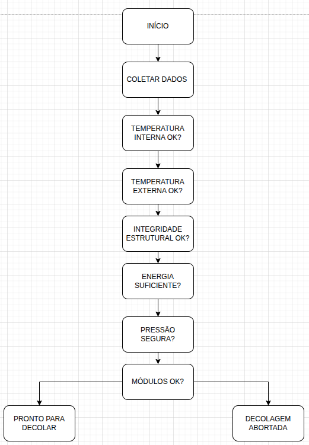

#  Sistema de Verificação de Decolagem

Este projeto simula um sistema responsável por verificar as condições de segurança de uma nave antes da decolagem.

---

## Objetivo

Garantir que todos os parâmetros estejam dentro dos limites seguros, evitando falhas críticas durante a decolagem.

---

##  Funcionalidades

- Coleta de dados de telemetria
- Verificação de condições de segurança
- Simulação de decolagem
- Análise energética

---

## Parâmetros analisados

- Temperatura interna
- Temperatura externa
- Integridade estrutural
- Nível de energia
- Pressão do tanque
- Eventos críticos

---

##  Lógica do sistema

O sistema analisa todos os dados e decide:

- "Pronto para decolar"
-  "Decolagem abortada"

---

##  Fluxograma



---

## ▶ Como executar

No terminal:

```bash
python3 simulacao.py